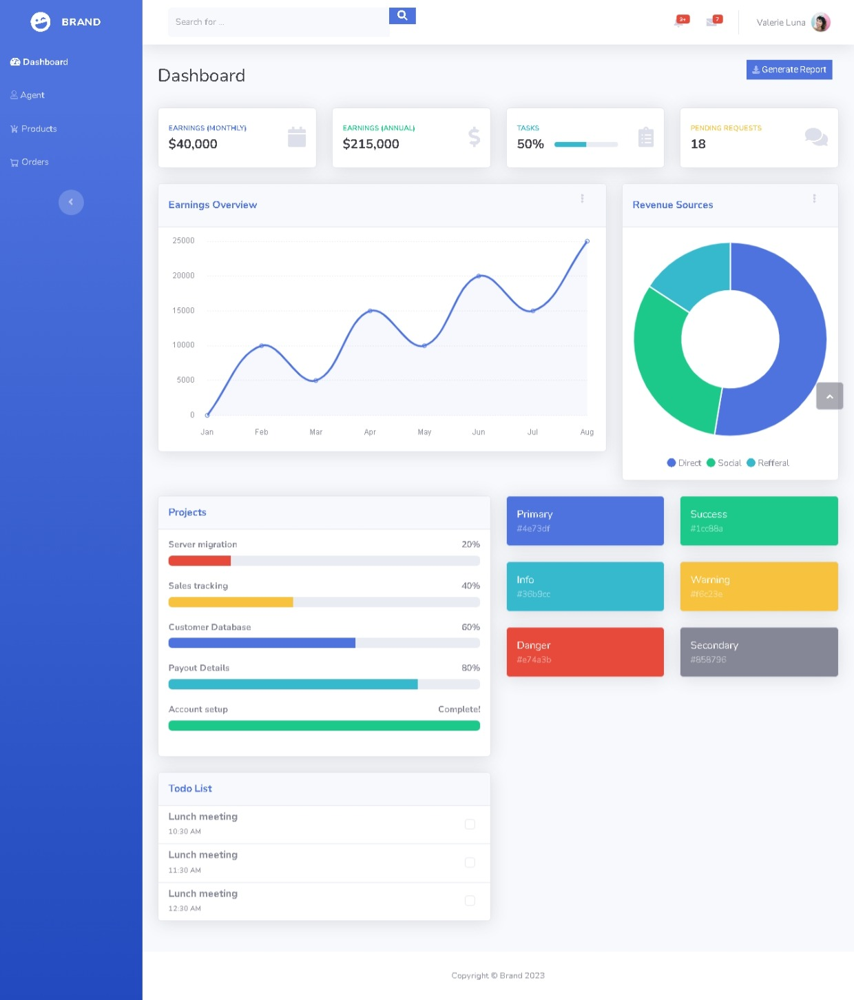
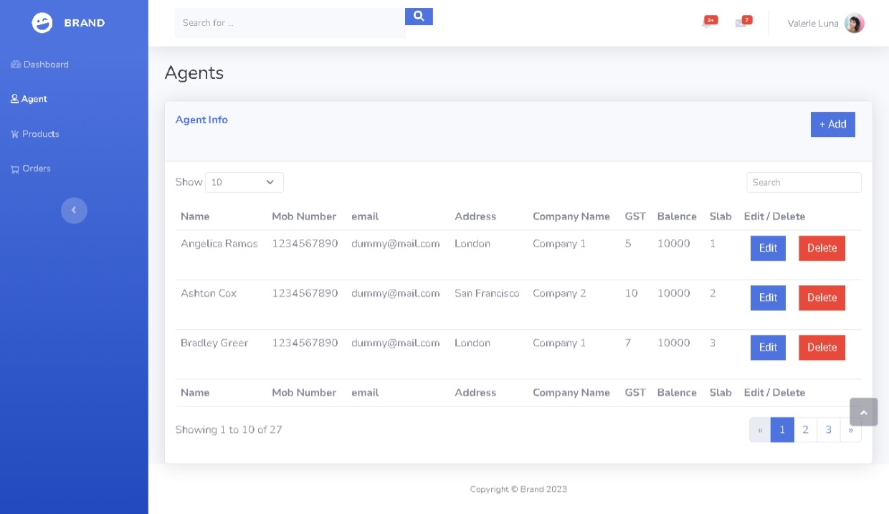
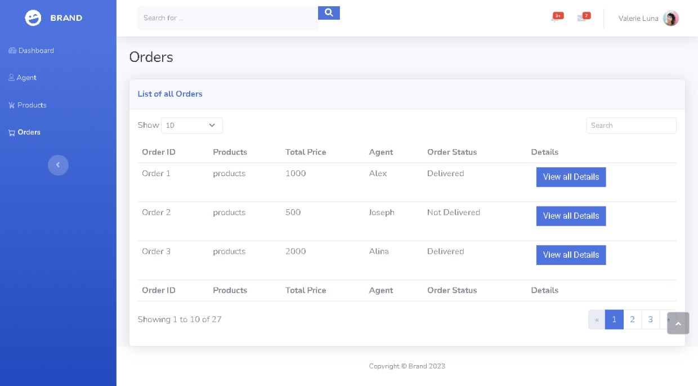
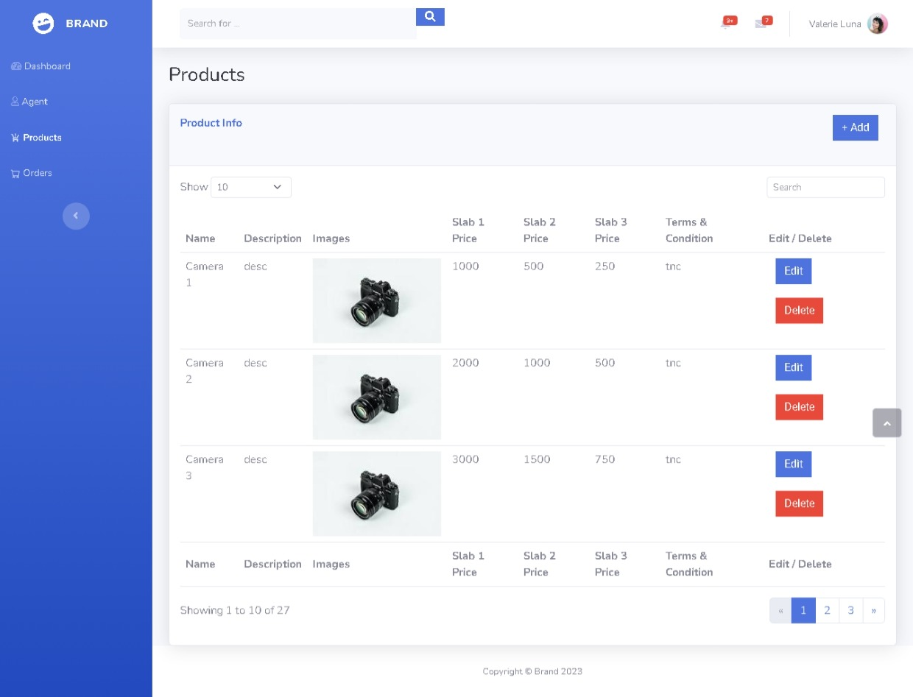

# E-commerce Admin-Agent Portal

A PHP-based web application for managing an **agent-based e-commerce business model**, built using a custom admin dashboard template designed in Bootstrap Studio.

This system enables an **Admin** to manage agents, products, and orders, and allows **Agents** to sell products with markup, manage orders, and view commissions in real-time.

## 👥 User Roles

### 🔒 Admin

- **Login**
- **Dashboard**: Overview of total agents, orders, and revenue
- **Agents Page**: 
  - Create agents with an initial balance
  - View all registered agents
- **Products Page**:
  - Add products with base prices
  - Edit or remove existing products
- **Orders Page**:
  - View all orders placed by agents
  - Update order status (e.g., Delivered/Not Delivered)

### 👤 Agent

- **Login**
- **Dashboard**: Displays current wallet balance
- **Products Page**:
  - Browse products
  - Add products to cart at their own resale price (markup)
- **My Cart**:
  - View cart summary
  - Confirm orders
  - Generate invoice
  - Balance is updated after order is confirmed
- **Orders Page**:
  - View order history
  - Check order details and status

## ⚙️ Tech Stack

- **Frontend**: HTML5, CSS3, Bootstrap 5 (via Bootstrap Studio template)
- **Backend**: PHP 8+
- **Database**: MySQL
- **Other**: JavaScript, jQuery

## 📝 Features Summary

| Feature              | Admin        | Agent        |
|----------------------|--------------|--------------|
| User Authentication  | ✅           | ✅           |
| Dashboard Overview   | ✅           | ✅           |
| Manage Agents        | ✅           | ❌           |
| View Balance         | ✅           | ✅           |
| Manage Products      | ✅           | ❌           |
| Browse Products      | ❌           | ✅           |
| Add to Cart          | ❌           | ✅           |
| Confirm Order        | ❌           | ✅           |
| Generate Invoice     | ❌           | ✅           |
| Order Tracking       | ✅           | ✅           |

## 📸 Screenshots

### Dashboard

### Agents Page

### Orders Page

### Products Page

---

Feel free to contribute, report issues, or fork this project to build your own custom e-commerce agent platform!
